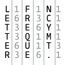
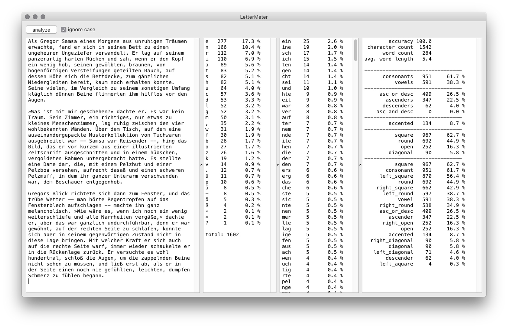

# Letter Frequency Meter

A text analysis tool, developed for postgraduate [TypeMedia](http://typemedia.org) course at the [Royal Academy of Arts in The Hague](http://www.kabk.nl). 

LetterFrequencyMeter generates a list of characters sorted by the frequency of use, and analyzes text according to its formal attributes. This version recognizes Latin, Cyrillic, and Greek characters.

© 2003, Just van Rossum, Peter Biľak

With thanks to Vera Evstafieva and Panos Haratzopoulos.

Inspired by [Ligature Counter](http://www.volcanokit.com/volcanokit2/ligCounter)

## LetterMeter RoboFont extension

*The original macOS app stopped working some years ago.*

*This version is a revival of Letter Frequency Meter as a RoboFont extension, using the original text analysis code.*

- *updated for RoboFont 3*
- *RoboFont 1.8 version available as a [download](https://github.com/gferreira/lettermeter/releases/tag/RF1.8)*
